# Anker 场景身份推理算法流程文档

本文档详细描述了 Anker 家庭安防场景下的身份推理（Identity Inference）算法流程。该系统采用**渐进式学习（Progressive Learning）**与**检索增强生成（RAG）**相结合的架构，通过从历史数据中抽取“事实记忆”和“规律记忆”，实现对新事件中人物身份（Role/Sub-role）的精准推理。

## 1. 算法总体架构

系统核心包含三个主要阶段：**记忆抽取与构建 (Extraction)**、**记忆检索与使用 (Usage)**、**推理与评估 (Inference & Evaluation)**。

```mermaid
graph TD
    subgraph "阶段一：记忆抽取与构建 (Training Stream)"
        Raw["原始安防日志"] --> Preprocess["预处理: 时间格式化/时段划分"]
        Preprocess --> LabelEmbed["标签嵌入 (Label Embedding)"]
        LabelEmbed --> AddMem["写入 MemOS 记忆库"]
        AddMem --> MemProcess["MemOS: 事实/规律提取"]
        MemProcess --> PatternMerge["模式合并 (Pattern Consolidation)"]
        PatternMerge --> MemStore[("记忆存储: Factual & Pattern")]
    end

    subgraph "阶段二：推理与使用 (Inference / Test Stream)"
        NewEvent["新事件"] --> Retrieve["记忆检索 (Retrieval)"]
        Retrieve --> FetchSimilar["检索相似历史事件 (Few-Shot)"]
        Retrieve --> FetchPattern["检索规律原型 (Prototypes)"]
        FetchSimilar & FetchPattern --> Context["构建推理上下文"]
        Context --> LLM["LLM 推理分类"]
        LLM --> PostProcess["后处理: 规则修正"]
        PostProcess --> Result["最终身份判决"]
    end
```



---

## 2. 模块详解

### 2.1 记忆抽取与构建 (Memory Extraction)

此阶段的目标是将原始的安防日志转化为机器可理解、可检索的结构化记忆。

#### 2.1.1 输入处理
- **数据源**: JSON 格式的安防事件日志（包含 timestamp, original_description, ground_truth labels）。
- **预处理**:
    - **时间格式化**: 将 `YYYYMMDDHHMMSS` 转换为 `YYYY-MM-DD HH:MM:SS`。
    - **时段划分**: 根据小时数划分为 Morning (6-12), Afternoon (12-18), Evening (18-22), Night (22-6)。

#### 2.1.2 记忆增强与注入 (Prompt Injection)
为了让 LLM 在推理时能利用历史数据，系统在训练阶段会**强制注入标签信息**到记忆内容中。

- **事实记忆 (Factual Memory)**:
    - 格式模板: `[Factual Memory] Time: {time} | Observation: {desc} | Ground Truth Label: Role={role}, Sub-role={sub_role}`
    - 目的: 提供带标签的历史样本，作为 Few-Shot Learning 的素材。

- **规律记忆 (Pattern Memory)**:
    - 格式模板: `Identity: {sub_role} ({role}) | Visuals: {desc}`
    - 目的: 建立“身份原型 (Identity Prototypes)”，例如“穿着粉色衣服带孩子的女性通常是 Family Member”。

#### 2.1.3 模式合并 (Pattern Consolidation)
为了防止记忆库中积累大量重复琐碎的规律，系统包含一个**自动去重与合并机制**：
1. **检索**: 定期检索所有的 `[Pattern Memory]`。
2. **聚类**: 按维度（如 family_commute, vehicle, pet）进行分组。
3. **合并 (Merge)**: 对同一维度的多条记忆调用 LLM 进行总结，生成一条更准确的“Master Pattern”。
   - *Input*: 多条零散的观察记录。
   - *Output*: 合并后的规律 + 时间范围 + 置信度。
4. **清理**: 写入合并后的新记忆，删除旧的零散记忆。

---

### 2.2 记忆检索与使用 (Memory Usage)

在推理阶段，系统通过 RAG 技术动态构建上下文。

#### 2.2.1 双路检索策略
对于每一个待推理的新事件，系统并行执行两类检索：

1.  **相似事件检索 (Few-Shot Examples)**
    *   **Query**: `Similar event: {current_event_description}`
    *   **Top-K**: 15 (从中筛选高质量样本)
    *   **筛选逻辑**: 优先保留包含 "Ground Truth Label" 的历史记忆。
    *   **作用**: 让 LLM 参考历史上的类似场景是如何被标记的。

2.  **规律原型检索 (Learned Prototypes)**
    *   **Query**: 隐含在相似检索结果中，筛选包含 `[Pattern Memory]` 且带有 `Identity:` 或 `Visuals:` 关键词的记忆。
    *   **作用**: 提供高层级的归纳知识（如“黑色轿车通常属于家人”）。

#### 2.2.2 推理 Prompt 构建
系统将检索到的信息组装成如下结构的 Prompt：

```text
Analyze this home security event and classify the identity based on learned family patterns.

[Learned Identity Prototypes]
- Identity: Family Member | Visuals: Woman in pink clothing...
- Identity: Delivery | Visuals: Person in yellow uniform...

[Historical Similar Events (Few-Shot Examples)]
1. [Factual Memory] ... Observation: Man in hat ... | Label: Family Member
2. ...

Current Event:
- Time: 2025-11-23 08:00:00 (Morning)
- Description: A man with a hat exits the residence...

## Classification System
(定义 Role Type 和 Sub-role Type 的分类标准)

## Key Guidance
(位置与视觉特征的判断准则，如 "Exiting residence" -> likely Family)
```

---

### 2.3 推理与后处理 (Inference & Post-processing)

#### 2.3.1 LLM 推理
LLM 输出包含四个字段：
- `role_type`: 大类（如 General Identity, Staff, Suspicious Person）。
- `sub_role_type`: 子类（如 Family Member, Delivery Person）。
- `confidence`: 置信度。
- `reasoning`: 推理依据。

#### 2.3.2 规则修正 (Heuristic Correction)
为了弥补 LLM 在空间感知和层级分类上的不足，系统包含一个**强制修正层** (`fix_classification_errors`)：

1.  **位置语义修正**:
    - 如果描述包含 "out of the courtyard", "exits residence" 等表示**从内部出来**的词汇，但 LLM 预测为 `Passerby`，则强制修正为 `Family Member`。
    - *逻辑*: 路人通常只在外部经过，不会从私有领地内部出来。

2.  **层级错误修正**:
    - 修正将 `Family Member` 或 `Visitor` 误作为 `role_type` 的情况（它们应归属于 `General Identity`）。
    - 修正具体的子类（如 Delivery Person）被误填为 Role 的情况。

---

## 3. 渐进式评估流程 (Progressive Evaluation)

为了模拟真实的持续学习场景，系统采用**渐进式 (Progressive)** 的训练/评估循环：

1.  **初始化**: 将数据集分为 Training Stream (训练流) 和 Validation Set (验证集，固定50条，无交集)。
2.  **分阶段循环 (Phases)**:
    - **Step 1: 学习 (Learn)**: 将 Training Stream 的一部分（如20%）写入记忆库，进行“记忆抽取”。
    - **Step 2: 评估 (Eval)**: 使用当前的记忆库，对 Validation Set 进行推理，计算准确率。
    - **Step 3: 记录**: 记录当前阶段的 Accuracy (Role/Sub-role/Anomaly) 变化。
3.  **最终推理**:
    - 完成所有训练阶段。
    - 将 Validation Set 也加入记忆库（补充完整知识）。
    - 对 Test Set (10月数据) 进行全量推理。

---

## 4. 关键文件索引

*   **主逻辑入口**: `examples/poc/anker_identity_inference.py`
    *   包含数据加载、记忆写入循环、推理逻辑、评估指标计算。
*   **Prompt 模板**: `src/memos/templates/mem_reader_prompts.py`
    *   包含 `SECURITY_EVENT_PATTERN_PROMPT` 等用于后端提取规律的指令。
*   **结果输出**: `examples/poc/inference_results/`
    *   包含各阶段的评估报告 (`.json`) 和准确率趋势图 (`.png`)。

