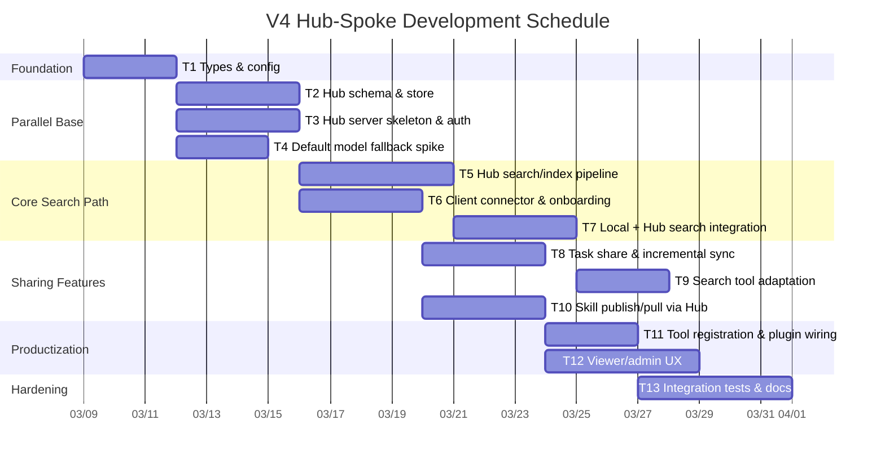

# V4 Hub Sharing Implementation Plan

> **For Claude:** REQUIRED SUB-SKILL: Use superpowers:executing-plans to implement this plan task-by-task.

**Goal:** Deliver the v4 Hub-Spoke memory and skill sharing architecture in safe, testable phases without blocking existing local memory behavior.

**Architecture:** Keep the current local memory plugin behavior intact, then layer in a centralized Hub mode, a Client connector, Hub-side shared search/indexing, and group/public sharing flows. Treat the OpenClaw default-model fallback as a separate capability track so platform uncertainty does not block the Hub MVP.

**Tech Stack:** TypeScript, `better-sqlite3`, existing local `RecallEngine`, HTTP server routes, FTS5, vector embeddings, Viewer UI, Vitest.

---

## Delivery Strategy

- **Execution style:** 3 major workstreams in parallel where possible
- **Critical path:** `T1 → T2/T3 → T5 → T6 → T7 → T9/T11 → T13`
- **Do not block MVP on:** advanced Viewer polish, full admin ergonomics, OpenClaw default-model fallback
- **MVP definition:** Hub up, user join/approve works, group/public task sharing works, local+Hub search works, Hub skill publish/pull works, Hub outage degrades to local-only

## Recommended Staffing

- **Track A — Platform/Core:** config, schema, Hub server, auth, search
- **Track B — Client Flows:** connector, sync, federated search, tools
- **Track C — UX/Viewer:** onboarding, admin approval UI, scope switch, shared result views

## Phase Schedule (Recommended)



## Milestones

| Milestone | Exit Criteria | Target |
|---|---|---|
| M1 Foundation Ready | Config resolves hub/client mode; schema and server skeleton compile | End of Week 1 |
| M2 Search Closed Loop | Hub can ingest shared task data and return filtered search results | Mid Week 2 |
| M3 Client Closed Loop | Client can join team, authenticate, search local + Hub, and degrade on Hub outage | End of Week 2 |
| M4 Sharing Closed Loop | Task share/unshare and skill publish/pull complete end-to-end | Mid Week 3 |
| M5 Product Ready | Viewer/admin flows, tests, docs, fallback behavior verified | End of Week 3 |

## Task Graph

```text
T1 Types & Config
├─ T2 Hub Schema & Store
├─ T3 Hub Server Skeleton & Auth
├─ T4 Default Model Fallback Spike
│
├─ T5 Hub Search/Index Pipeline        <- T2 + T3
├─ T6 Client Connector & Onboarding    <- T3 (+ T4 optional for fallback hookup)
├─ T7 Local + Hub Search Integration   <- T5 + T6
│
├─ T8 Task Share & Incremental Sync    <- T5 + T6
├─ T9 Search Tool Adaptation           <- T7
├─ T10 Skill Publish/Pull via Hub      <- T5 + T6
│
├─ T11 Tool Registration & Wiring      <- T8 + T9 + T10
├─ T12 Viewer/Admin UX                 <- T8 + T9 + T10
└─ T13 Integration Tests & Docs        <- T11 + T12
```

## Work Breakdown

### Task 1: Types and configuration foundation

**Files:**
- Create: `apps/memos-local-openclaw/src/sharing/types.ts`
- Modify: `apps/memos-local-openclaw/src/types.ts`
- Modify: `apps/memos-local-openclaw/src/config.ts`
- Test: `apps/memos-local-openclaw/tests/integration.test.ts`

**Deliverables:**
- Add Hub/Client mode config types
- Define `HubSearchHit`, `NetworkSearchResult`, `UserInfo`, `GroupInfo`, `SkillBundle`
- Define fallback capability flags instead of assuming OpenClaw APIs always exist

**Done when:**
- Types compile
- Config parsing supports hub/client branches cleanly
- Existing local-only config remains backward compatible

### Task 2: Hub schema and store layer

**Files:**
- Modify: `apps/memos-local-openclaw/src/storage/sqlite.ts`
- Test: `apps/memos-local-openclaw/tests/storage.test.ts`
- Test: `apps/memos-local-openclaw/tests/integration.test.ts`

**Deliverables:**
- Add `hub_users`, `hub_groups`, `hub_group_members`, `hub_tasks`, `hub_chunks`, `hub_embeddings`, `hub_skills`
- Add uniqueness constraints for source IDs
- Add CRUD helpers for user approval, group membership, shared task/skill upsert, shared delete

**Done when:**
- Repeated share requests are idempotent
- Group membership queries are fast and test-covered
- Existing local tables remain backward compatible

### Task 3: Hub server skeleton and auth

**Files:**
- Create: `apps/memos-local-openclaw/src/hub/server.ts`
- Create: `apps/memos-local-openclaw/src/hub/auth.ts`
- Create: `apps/memos-local-openclaw/src/hub/user-manager.ts`
- Modify: `apps/memos-local-openclaw/index.ts`
- Test: `apps/memos-local-openclaw/tests/plugin-impl-access.test.ts`

**Deliverables:**
- Start/stop Hub HTTP server in hub mode
- Implement team-token join flow and JWT user-token verification
- Register `/hub/info`, `/hub/join`, `/hub/me`, `/hub/admin/*` skeleton routes
- Add rate limiting middleware

**Done when:**
- Admin can bootstrap team
- Pending user can join and wait for approval
- Approved user receives valid token and blocked user is rejected

### Task 4: Default-model fallback spike

**Files:**
- Modify: `apps/memos-local-openclaw/src/embedding/index.ts`
- Modify: `apps/memos-local-openclaw/src/ingest/providers/index.ts`
- Modify: `apps/memos-local-openclaw/src/types.ts`
- Test: `apps/memos-local-openclaw/tests/integration.test.ts`

**Deliverables:**
- Add an `openclaw` provider abstraction if host capabilities exist
- Detect host capability instead of assuming `api.embed()` / `api.complete()`
- Preserve current local/heuristic fallback as final safety net

**Done when:**
- No explicit provider still works
- Missing host capability does not break startup
- Fallback chain is logged and testable

### Task 5: Hub search and indexing pipeline

**Files:**
- Create: `apps/memos-local-openclaw/src/hub/search.ts`
- Modify: `apps/memos-local-openclaw/src/hub/server.ts`
- Modify: `apps/memos-local-openclaw/src/storage/sqlite.ts`
- Test: `apps/memos-local-openclaw/tests/recall.test.ts`
- Test: `apps/memos-local-openclaw/tests/integration.test.ts`

**Deliverables:**
- Receive shared task/chunk payloads from clients
- Re-embed and FTS-index all shared chunks on Hub
- Filter by requester user groups and `public`
- Return `remoteHitId`-based Hub search results

**Done when:**
- A shared task becomes searchable on Hub
- A user cannot see data from groups they do not belong to
- `memory-detail` honors permissions and hit expiry

### Task 6: Client connector and onboarding

**Files:**
- Create: `apps/memos-local-openclaw/src/client/connector.ts`
- Modify: `apps/memos-local-openclaw/src/viewer/server.ts`
- Modify: `apps/memos-local-openclaw/src/viewer/html.ts`
- Modify: `apps/memos-local-openclaw/src/storage/sqlite.ts`
- Test: `apps/memos-local-openclaw/tests/shutdown-lifecycle.test.ts`

**Deliverables:**
- Persist Hub connection state in `client_hub_connection`
- Implement join-team and create-team state machine
- Add connection health and reconnect handling
- Expose waiting-approved / active / rejected states to Viewer

**Done when:**
- Fresh install can choose create-team or join-team
- Client survives Hub restart and reconnects
- Rejected client is visibly blocked from Hub actions

### Task 7: Local + Hub search integration

**Files:**
- Create: `apps/memos-local-openclaw/src/client/federated-search.ts`
- Modify: `apps/memos-local-openclaw/src/recall/engine.ts`
- Modify: `apps/memos-local-openclaw/src/types.ts`
- Test: `apps/memos-local-openclaw/tests/integration.test.ts`

**Deliverables:**
- Execute local search and Hub search in parallel for `group/all`
- Return local and Hub results in separate sections
- Degrade to local-only when Hub is unavailable

**Done when:**
- `scope=local` is unchanged
- `scope=group/all` returns stable two-section results
- Hub outage does not break the tool

### Task 8: Task share and incremental sync

**Files:**
- Create: `apps/memos-local-openclaw/src/client/sync.ts`
- Modify: `apps/memos-local-openclaw/index.ts`
- Modify: `apps/memos-local-openclaw/src/storage/sqlite.ts`
- Test: `apps/memos-local-openclaw/tests/task-processor.test.ts`
- Test: `apps/memos-local-openclaw/tests/integration.test.ts`

**Deliverables:**
- Implement `task_share` and `task_unshare`
- Push full task on first share, then incremental chunks on `agent_end`
- Track sync cursor or last-pushed chunk for idempotent uploads

**Done when:**
- Shared task appears on Hub
- New chunks for shared task are pushed once
- Unshare removes data from Hub and stops future push

### Task 9: Search tool adaptation

**Files:**
- Modify: `apps/memos-local-openclaw/src/tools/memory-search.ts`
- Modify: `apps/memos-local-openclaw/index.ts`
- Test: `apps/memos-local-openclaw/tests/integration.test.ts`

**Deliverables:**
- Add `scope: local | group | all` to `memory_search`
- Add Hub-aware formatting to `skill_search`
- Preserve current local tool UX for existing users

**Done when:**
- Existing prompts still work unchanged
- New Hub scopes return intelligible, separable outputs

### Task 10: Skill publish and pull via Hub

**Files:**
- Modify: `apps/memos-local-openclaw/src/skill/installer.ts`
- Create: `apps/memos-local-openclaw/src/client/skill-sync.ts`
- Modify: `apps/memos-local-openclaw/index.ts`
- Test: `apps/memos-local-openclaw/tests/integration.test.ts`

**Deliverables:**
- Publish full skill bundle to Hub with group/public scope
- Pull bundle from Hub with client-side safety validation
- Store provenance for pulled skills

**Done when:**
- Group member can publish and another group member can pull
- Unauthorized user cannot pull group-restricted skill
- Malformed bundle is rejected atomically

### Task 11: Tool registration and plugin wiring

**Files:**
- Modify: `apps/memos-local-openclaw/index.ts`
- Test: `apps/memos-local-openclaw/tests/plugin-impl-access.test.ts`

**Deliverables:**
- Register `task_share`, `task_unshare`, `network_memory_detail`, `network_skill_pull`, `network_team_info`
- Start Hub services in hub mode and connector in client mode
- Keep local-only mode intact

**Done when:**
- Tool list changes by mode as intended
- Startup/shutdown lifecycle remains clean

### Task 12: Viewer and admin UX

**Files:**
- Modify: `apps/memos-local-openclaw/src/viewer/server.ts`
- Modify: `apps/memos-local-openclaw/src/viewer/html.ts`
- Test: `apps/memos-local-openclaw/tests/integration.test.ts`

**Deliverables:**
- Hub-side admin approval and group management
- Client-side connection status and scope switch
- Shared search results with owner/group metadata
- Skill browser and pull actions

**Done when:**
- Admin can approve users and manage groups in Viewer
- Client can see its state and accessible Hub content clearly

### Task 13: Integration tests and docs

**Files:**
- Modify: `apps/memos-local-openclaw/tests/integration.test.ts`
- Modify: `apps/memos-local-openclaw/tests/storage.test.ts`
- Modify: `apps/memos-local-openclaw/tests/shutdown-lifecycle.test.ts`
- Modify: `apps/memos-local-openclaw/README.md`

**Deliverables:**
- End-to-end tests for join, approve, group isolation, task share, incremental sync, skill pull, Hub outage fallback, fallback model behavior
- README updates for hub/client setup and default model behavior

**Done when:**
- MVP flow is test-covered end-to-end
- README is sufficient for a fresh teammate to run Hub and join as client

## Release Recommendation

- **MVP Cut:** T1–T11 complete, T12 basic UI only, T13 essential integration tests only
- **Post-MVP Cut:** advanced admin UX, analytics, team-token rotation UX polish, richer Hub browsing
- **Spike Before Coding:** verify whether OpenClaw host truly exposes embedding/completion APIs; if not, keep local/heuristic fallback as the documented default fallback path

## Suggested Calendar

| Week | Focus | Primary Owners |
|---|---|---|
| Week 1 | Foundation + Hub base (`T1-T4`) | Core + Platform |
| Week 2 | Hub search + connector + combined search (`T5-T7`) | Core + Client |
| Week 3 | Share/pull flows + tools + basic UI (`T8-T12`) | Client + UX |
| Week 4 | Hardening, test expansion, docs (`T13`) | Whole team |

## Critical Path Notes

- `T4` must not block Hub MVP unless OpenClaw fallback is a release requirement
- `T12` should not block API completion; ship a minimal admin UI first
- `T13` should prioritize permission isolation and outage fallback before UI polish
